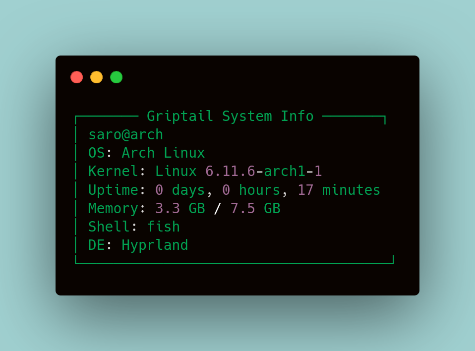

# Griptail
A lightweight, minimalist system information display tool for Linux written in C.


## Overview
Griptail is a fast and efficient system information display tool that shows essential system details in a clean, organized format. It's designed to be lightweight and dependency-free.

## Features
- Clean, minimalist display
- System information including:
  - OS Distribution
  - Kernel version
  - System uptime
  - Memory usage
  - Shell information
  - Desktop Environment
- Zero external dependencies
- Written in pure C
- Lightweight (< 100KB)

## Installation

### Arch Linux (AUR)
Griptail is available in the Arch User Repository (AUR). You can install it using an AUR helper:

```bash
# Using yay
yay -S griptail

# Using paru
paru -S griptail
```

Or manually from the AUR:
```bash
git clone https://aur.archlinux.org/griptail.git
cd griptail
makepkg -si
```

### Prerequisites
Make sure you have GCC and Make installed on your system:
```bash
# On most Linux distributions, you'll need:
gcc
make
```

### Building from Source
1. Clone the repository:
```bash
git clone https://github.com/codiwithsarthak/griptail.git
cd griptail
```

2. Build the program:
```bash
make
```

3. Install (optional):
```bash
sudo make install
```

### Uninstalling
```bash
sudo make uninstall
```

## Usage
Simply run:
```bash
griptail
```

If installed locally (without `make install`):
```bash
./griptail
```

## Example Output
```
┌─────── Griptail System Info ───────┐
│ saro@arch
│ OS: Arch Linux
│ Kernel: Linux 6.11.6-arch1-1
│ Uptime: 0 days, 0 hours, 50 minutes
│ Memory: 4.7 GB / 7.5 GB
│ Shell: fish
│ DE: Hyprland
└─────────────────────────────────────┘
```

## Contributing
Contributions are welcome! Please feel free to submit a Pull Request.

## License
This project is licensed under the MIT License - see the [LICENSE](LICENSE) file for details.

## Support
If you encounter any issues or have questions, please file an issue on the GitHub repository.
